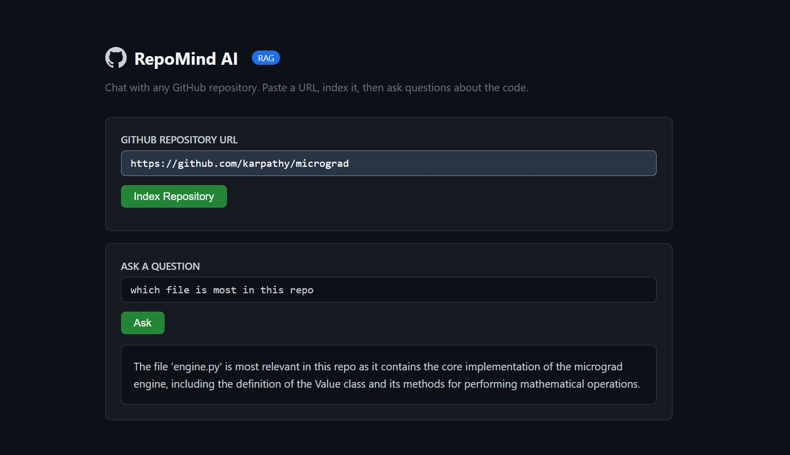

# 🧠 RepoMind AI

Chat with any GitHub repository. Paste a repo URL, index it, and ask natural language questions about the codebase — powered by a RAG (Retrieval-Augmented Generation) pipeline.



---
---
title: RepoMind AI
emoji: 🧠
colorFrom: blue
colorTo: green
sdk: docker
app_port: 7860
pinned: false
---

## What it does

1. Paste any public GitHub repository URL
2. Backend clones the repo, filters out noise (lock files, images, build artifacts, `node_modules`, etc.), and splits the remaining source code into chunks
3. Chunks are embedded and stored in a local FAISS vector index
4. Ask a question — the most relevant code chunks are retrieved and passed to an LLM (Groq LLaMA 3.3 70B) to generate a grounded answer

No repo history, credentials, or code ever leaves your machine except the specific chunks sent to the LLM for answering.

---

## Tech Stack

| Layer | Technology |
|---|---|
| Backend API | FastAPI |
| RAG Orchestration | LangChain (LCEL) |
| Vector Store | FAISS |
| Embeddings | FastEmbed |
| LLM | Groq — LLaMA 3.3 70B |
| Repo Cloning | GitPython |
| Frontend | Vanilla HTML/CSS/JS |

---

## Architecture

```
GitHub URL
    │
    ▼
Clone repo (shallow clone, depth=1)
    │
    ▼
Filter junk files (lock files, binaries, node_modules, .git, etc.)
    │
    ▼
Chunk source code (RecursiveCharacterTextSplitter)
    │
    ▼
Embed chunks (FastEmbed) → Store in FAISS index
    │
    ▼
User question ──► Retrieve top-k relevant chunks ──► Groq LLaMA 3.3 70B ──► Answer
```

---

## Project Structure

```
RepoMindAI/
├── backend/
│   ├── main.py              # FastAPI app entry point
│   ├── routes/
│   │   ├── ingest.py        # POST /ingest — clone, filter, chunk, embed
│   │   └── chat.py          # POST /chat — RAG-based Q&A
│   ├── services/
│   │   ├── cloner.py        # Clones repo via GitPython
│   │   ├── filter.py        # Filters out non-essential files
│   │   ├── chunker.py       # Splits code into chunks
│   │   ├── embedder.py      # Embeds chunks, saves FAISS index
│   │   └── rag.py           # LangChain LCEL RAG chain with Groq
│   ├── schemas.py           # Pydantic request/response models
│   └── config.py            # Environment configuration
├── frontend/
│   └── index.html           # Single-page UI
├── requirements.txt
└── README.md
```

---

## Getting Started

### Prerequisites
- Python 3.10+
- Git installed and available in PATH
- A free [Groq API key](https://console.groq.com)

### Installation

```bash
git clone https://github.com/<your-username>/RepoMindAI.git
cd RepoMindAI

python -m venv venv
venv\Scripts\activate        # Windows
# source venv/bin/activate   # macOS/Linux

pip install -r requirements.txt
```

### Configuration

Create a `.env` file in the root directory:

```env
GROQ_API_KEY=your_groq_api_key_here
```

### Run the backend

```bash
uvicorn backend.main:app --reload --reload-exclude temp
```

API will be available at `http://127.0.0.1:8000`  
Interactive API docs: `http://127.0.0.1:8000/docs`

### Run the frontend

Open `frontend/index.html` directly in your browser.

---

## Usage

1. Paste a GitHub repository URL (e.g. `https://github.com/karpathy/micrograd`)
2. Click **Index Repository** and wait for confirmation
3. Type a question about the codebase and click **Ask**

---

## Example

**Repo:** `https://github.com/karpathy/micrograd`

**Question:** *"What does this repository do?"*

**Answer:** *"This repository is for a Python library called 'micrograd', a tiny scalar-valued autograd engine with a small PyTorch-like neural network library on top..."*

---

## Design Decisions

- **Shallow clone (`depth=1`)** — avoids downloading full commit history, keeping ingestion fast even for larger repos
- **File filtering** — excludes lock files, binaries, `node_modules`, `.git`, and other non-source content to keep the vector index relevant
- **FastEmbed over sentence-transformers** — smaller download size, faster cold start
- **LCEL (LangChain Expression Language)** — modern, composable chain syntax over legacy `Chain` classes

---

## Limitations

- Currently indexes up to the first 100 filtered files per repo (configurable in `chunker.py`)
- Files larger than ~30KB are skipped to avoid processing generated/minified code
- No authentication layer — intended as a local development / portfolio demo tool

---

## Author

Built by Saqlain — Software Engineer specializing in Python, .NET, and LLM/RAG systems.

- GitHub: [Py-saqlain](https://github.com/Py-saqlain)
- HuggingFace: [py-saqlain](https://huggingface.co/py-saqlain)
